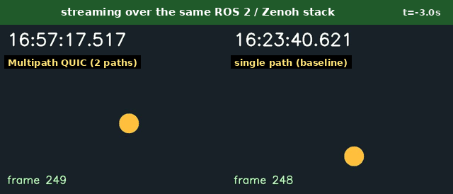

# ros2-mpquic-demo

**A ROS 2 camera stream that survives a network-path failure — live, in your
browser, with measured QoE.**

One QUIC connection, two network paths. Pull the primary path mid-stream and
the video stutters for a moment instead of blacking out for the whole outage:



(two `./demo.sh` runs, captured from the live browser stream and aligned at
the failure instant — that is why the two wall clocks differ)

|                       | Multipath QUIC | single path (baseline) |
|-----------------------|---------------:|-----------------------:|
| worst video freeze    |    **1872 ms** |           **10710 ms** |
| frames lost           |   **17 / 675** |             213 / 670  |
| path-failure detection|         ~0.3 s |     n/a (session died) |
| QUIC connections used |  1 (no reconnect) | reconnect after recovery |

(the same two runs the GIF shows; 20 fps synthetic camera, 10 s primary-path
outage injected mid-stream, Linux netns + netem topology. Every run writes
its raw logs and a per-frame CSV to `./logs/<mode>/`, so when you run the
demo yourself you can recompute every number in this table from your own
data)

```
camera_sim --CycloneDDS-- zenoh-bridge-ros2dds ==MPQUIC (2 paths)== zenoh-bridge-ros2dds --CycloneDDS-- qoe_monitor --> your browser
  (netns zc, ROS domain 0)                                             (netns zs, ROS domain 1)          http://localhost:8480
```

The transport is [Zenoh](https://github.com/eclipse-zenoh/zenoh) with an
experimental QUIC backend based on [noq](https://github.com/n0-computer/noq)
(Quinn fork implementing
[draft-ietf-quic-multipath](https://datatracker.ietf.org/doc/draft-ietf-quic-multipath/)),
one UDP socket per NIC (`SO_BINDTODEVICE`), and out-of-band interface
monitoring (netlink) for ~300 ms failure detection. ROS 2 and
`zenoh-bridge-ros2dds` are unmodified (the bridge is only rebuilt against the
fork).

## What you see

- A synthetic camera (wall clock + frame counter + bouncing ball) streamed as
  a ROS 2 `CompressedImage` topic across the bridge, viewable live in a
  browser (MJPEG).
- Mid-stream, the primary network interface is taken down. With multipath the
  ball stutters for a moment (0.5–1.9 s across our runs) and keeps bouncing;
  the baseline freezes for the whole outage and drops every frame in it.
- A QoE summary (frame loss, latency percentiles, freeze durations, per-frame
  CSV) and the path-event log (detection latency, no-reconnect proof) are
  printed automatically.

## Running it

Prerequisites: Linux, Docker, Rust, `openssl`, and the sibling fork checkouts
(this repo expects the workspace layout below; the forks carry the multipath
backend):

```
workspace/
├── zenoh/                  # github.com/mp0rta/zenoh                branch feat/noq-mpquic-poc
├── noq/                    # github.com/mp0rta/noq                  branch feat/mpquic-poc
├── zenoh-plugin-ros2dds/   # github.com/mp0rta/zenoh-plugin-ros2dds branch feat/mpquic-demo
└── ros2-mpquic-demo/       # this repo
```

```bash
# 1. build the bridge against the forks (once)
( cd ../zenoh-plugin-ros2dds && cargo build -p zenoh-bridge-ros2dds )

# 2. build the demo image (once)
docker build -t mpquic-demo:local .

# 3. run — then open http://localhost:8480 and watch
./demo.sh              # multipath: the stream survives the outage
./demo.sh --single     # baseline: the stream blacks out
```

`STEADY_SECS` extends the watch time before the failure is injected;
`VIEW_PORT` changes the browser port. Everything runs inside one privileged
container (network namespaces + veth + netem); nothing touches your host
network beyond the browser port on localhost. Logs and the per-frame CSV
land in `./logs/<mode>/`.

The bridge binary is built on the host and runs inside the container
(Ubuntu 24.04 base) — if your host's glibc is newer than the container's,
build the bridge inside a matching container instead.

## Honesty notes

- The QoE advantage shown here is **continuity/availability**: seamless
  failover of one logical connection. Bandwidth **aggregation** across paths
  (e.g. `/camera` steering in mixed workloads) needs a multipath scheduler,
  which is future work in the underlying stack (today noq sends on the
  lowest available path).
- The baseline is genuinely handicapped by having one NIC; that is the point
  of the comparison — multipath turns standby hardware into instant failover
  without any application change.
- Frame-loss figures depend on QoS: the demo uses best-effort sensor QoS.
  During the multipath failover most of the stalled frames were still
  delivered (retransmission drains the stall; a short consecutive burst —
  17 of 675 frames in the tabled run — fell out of the best-effort queue at
  the failover instant), while the baseline's 10 s outage dropped them all.
- The multipath worst freeze varies run to run: we observed 0.5–1.9 s
  across repeated runs on one machine, while detection (~0.3 s) and the
  baseline's ~10.7 s blackout were stable. The table shows one run, not a
  best case — run it yourself and read your own numbers.
- The detection figure is measured by polling the bridge log every 50 ms,
  so it is an upper bound with ~0.1 s of quantization — hence "~0.3 s".

## License

[Apache-2.0](LICENSE)

## Repository layout

- `ros/camera_sim.py` — synthetic camera (frame id in `header.frame_id`,
  send time in `header.stamp`, both drawn into the picture)
- `ros/qoe_monitor.py` — QoE measurement + MJPEG server for the browser
- `configs/` — zenoh bridge configs (multipath + single-path baseline)
- `netns.sh`, `gen-certs.sh`, `Dockerfile`, `demo.sh`
